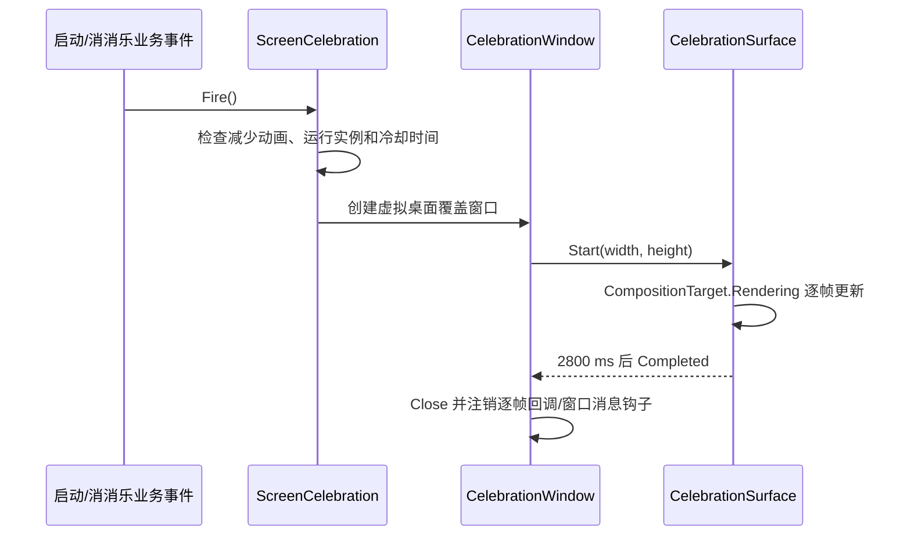

# CapyLulu 屏幕级彩纸与 Emoji 庆祝动画

本文记录 CapyLulu 当前已经落地的庆祝动画实现。代码以
[`ScreenCelebration.cs`](../src/CapyLulu/ScreenCelebration.cs) 为准；本文不再描述
Electron、React 或未采用的候选方案。

## 实录参考

[播放 Codex 礼花 MP4](./codex-confetti-demo.mp4)


实现按实录重新校准过视觉比例：大尺寸 `🥳`、`🎉` 和金色四角星是主体，小彩纸
主要是彩色圆点和短线。所有大图形在向屏幕中央扇形扩散的同时持续顺时针或逆时针
旋转，然后受重力影响下落并逐渐消失。

## 1. 触发场景

屏幕庆祝只由两个业务事件触发：

1. **宠物成功启动**：`MainWindow.OnLoaded` 完成角色动作图加载并恢复窗口位置后触发。
   动作图缺失或解码失败时不触发。
2. **消消乐奖励达成**：`MatchGameWindow.CelebrateAsync` 进入奖励结算时触发。
   这只是额外叠加一层屏幕动画，不替换、延迟或删减消消乐原有的 Bonus 卡片、
   棋盘清场、庆祝 GIF、继续按钮和棋盘恢复流程。

第二次启动单实例 EXE 只会唤回已有宠物窗口，不会重复播放“成功启动”庆祝。



## 2. 窗口行为

庆祝动画使用一个播放期间才存在的独立 WPF `Window`，而不是嵌在宠物窗口或消消乐
窗口里的控件。

- 位置和尺寸取 `SystemParameters.VirtualScreen*`，覆盖整个 Windows 虚拟桌面。
- `AllowsTransparency=true`，背景完全透明。
- `Topmost=true`，动画位于桌面和应用窗口之上。
- `ShowActivated=false`、`Focusable=false`，显示时不抢走当前输入焦点。
- `ShowInTaskbar=false` 和 `WS_EX_TOOLWINDOW`，不出现在任务栏或 Alt+Tab 列表。
- `WS_EX_TRANSPARENT` 配合 `WM_NCHITTEST → HTTRANSPARENT`，鼠标可以穿透覆盖窗口。
- `WS_EX_NOACTIVATE` 防止键盘焦点被覆盖窗口取得。

因此用户在动画期间仍然可以点击、输入、拖动宠物或操作消消乐。

## 3. 当前视觉参数

| 参数 | 当前值 | 说明 |
|---|---:|---|
| 总时长 | 2800 ms | 到时关闭覆盖窗口 |
| 小彩纸 | 104 个 | 约四分之三为圆点，其余为短线 |
| 大图形 | 64 个 | `🥳`、`🎉` 与金色四角星 |
| 总元素上限 | 168 个 | 保持在 200 个以内 |
| 冷却时间 | 1500 ms | 动画运行期间仍优先由单实例保护 |
| 重力 | 720 DIP/s² | 形成先扩散、后坠落的轨迹 |
| 帧间隔上限 | 50 ms | 窗口卡顿后不进行过大的物理步进 |
| 淡出区间 | 最后 420 ms | 每个元素按自己的寿命淡出 |

左右两侧分别设置约 `32%` 和 `68%` 屏幕高度的喷射带，并加入随机偏移。初速度在
扇形范围内随机分解为横向和纵向分量，左右两侧互为镜像；横向速度会按虚拟桌面宽度
缩放并限制上下界，使 1080p、4K 和多显示器桌面都能向中部扩散。

小彩纸的旋转速度绝对值为 `360～820°/s`。大图形的旋转速度绝对值为
`150～360°/s`，方向随机，因此不会出现抽到接近零后看似只做平移的 Emoji。纸片还会
使用余弦缩放横向宽度，模拟翻面的视觉变化。

## 4. 彩色 Emoji 资源

WPF 的 `FormattedText`/`TextBlock` 在当前渲染路径下会把系统 Emoji 画成单色轮廓，
与实录中的高饱和彩色图形差异很大。因此正式实现不再依赖运行机器的 Emoji 字体，
而是使用两张透明彩色 PNG：

- `Resources/Celebration/party-face.png`
- `Resources/Celebration/party-popper.png`

两张图片都是 `192 × 192`，通过 `CapyLulu.csproj` 的 WPF `Resource` 项嵌入程序集，
单文件发布后不需要外部素材。运行时从 `CapyLulu.g.resources` 读取为
`BitmapImage`，设置 `BitmapCacheOption.OnLoad` 后冻结，因此资源流可以立即释放并在
渲染线程安全复用。

金色四角星使用冻结的 WPF `Geometry`、画刷和描边绘制，并带一个较小的浅色高光；
不需要额外位图。

## 5. 粒子更新与绘制

`CelebrationSurface` 是轻量 `FrameworkElement`。它用 `CompositionTarget.Rendering`
与显示刷新同步，通过 `Stopwatch` 取得实际时间差，不创建每粒子一个 WPF 控件或动画
对象。

每帧执行的核心更新为：

```text
delay -= dt
vy += gravity * dt
vx *= 0.58 ^ dt
x += vx * dt
y += vy * dt
rotation += rotationSpeed * dt
opacity = 按粒子寿命在最后 420 ms 淡出
```

绘制顺序是“小彩纸 → 大图形”，让 Emoji 和星形保持清晰。大图形出生后的前
`120 ms` 从约 `68%` 缩放到完整尺寸，同时继续移动和自转，形成烟花爆开的感觉。

## 6. 调度、辅助功能和容错

`ScreenCelebration.Fire()` 是唯一入口：

- `_activeWindow` 保证同一时刻只存在一个覆盖窗口；运行中的重复请求被忽略。
- `Environment.TickCount64` 记录上次启动时间，冷却期内不会再次创建窗口。
- 从非 UI 线程调用时，通过应用 `Dispatcher` 切回 WPF UI 线程。
- `SystemParameters.ClientAreaAnimation=false` 时直接跳过，遵循 Windows“动画效果”偏好。
- 庆祝属于装饰性反馈；创建失败只写入调试输出，不让宠物或消消乐流程失败。

## 7. 资源清理

动画结束或应用退出时会完成以下清理：

1. 从 `CompositionTarget.Rendering` 注销逐帧回调。
2. 停止并清空 `Stopwatch`、彩纸列表和大图形列表。
3. 从 `HwndSource` 移除窗口消息钩子。
4. 关闭透明覆盖窗口。
5. `Closed` 回调清空 `ScreenCelebration` 保存的活动窗口引用。

没有常驻后台线程、DispatcherTimer、粒子控件或独立进程。

## 8. 验证

`tests/CapyLulu.Validation` 当前验证：

- 动画时长位于 2～3 秒范围内。
- 小彩纸数量足够形成爆发密度。
- 大图形数量大于零。
- 总元素数不超过 200 个性能预算。
- 冷却时间为正数。
- 两张彩色 PNG 已进入 `CapyLulu.g.resources`。
- 在 STA 线程实际初始化 `CelebrationSurface` 的静态资源，及时发现图片损坏、资源名
  或加载路径错误。

建议人工验收时分别从发布版 EXE 启动和消消乐奖励达成两个入口观察，并确认：

- 左右喷射带都能出现，元素快速向屏幕中央扇形扩散。
- `🥳`、`🎉` 和星形尺寸明显大于圆点/短线，颜色与实录接近。
- 大图形扩散期间始终有明显的顺/逆时针自转。
- 动画期间能正常点击其下方窗口，焦点不会跳走。
- 约 2.8 秒后覆盖层完全消失。
- 消消乐自身奖励演出从头到尾保持原有顺序和内容。

## 9. 相关文件

| 文件 | 职责 |
|---|---|
| `src/CapyLulu/ScreenCelebration.cs` | 覆盖窗口、粒子模型、逐帧更新和绘制 |
| `src/CapyLulu/MainWindow.cs` | 宠物成功启动触发点 |
| `src/CapyLulu/MatchGameWindow.cs` | 消消乐奖励触发点及原有奖励演出 |
| `src/CapyLulu/Resources/Celebration/*.png` | 内嵌彩色 Emoji 图形 |
| `src/CapyLulu/CapyLulu.csproj` | WPF Resource 打包配置 |
| `tests/CapyLulu.Validation/Program.cs` | 参数、资源和加载路径验证 |
