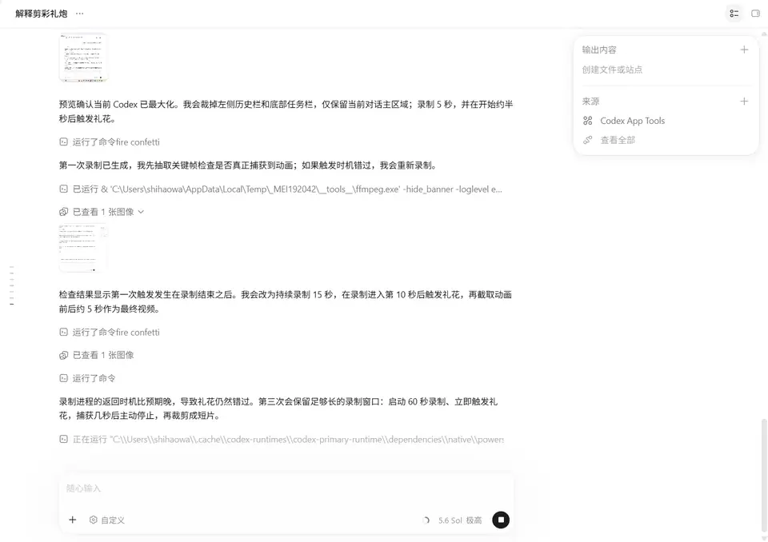
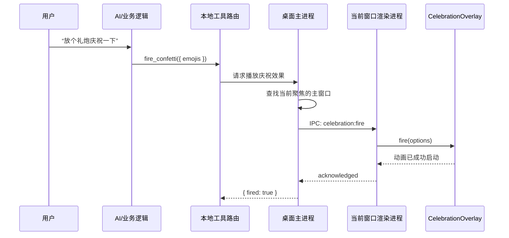

# 前端彩纸与 Emoji 庆祝动画实现设计

> 本文描述一种可复刻的近似实现方案，用于解释 Codex 桌面端“礼炮/彩纸庆祝”类效果可能采用的技术链路。它不代表 OpenAI 未公开的内部源码。

## 实录示例

[播放 Codex 礼花 MP4](./codex-confetti-demo.mp4)



该实录展示了实际界面中的效果：礼花从窗口左右边缘喷出，彩色圆点、星形和庆祝 Emoji 在主内容区扩散，然后受重力影响向下飘落并逐渐消失。

## 1. 目标

当用户明确提出“放个礼炮”“庆祝一下”等请求时，桌面应用在当前窗口上方播放一次短暂的彩纸与 Emoji 动画。

核心要求：

- 动画持续约 2～3 秒，不打断用户操作。
- 彩纸数量较多，Emoji 数量较少并保持清晰。
- 覆盖整个窗口，但不能拦截鼠标和键盘事件。
- 同一时刻只保留一个动画实例，连续触发时进行合并或限流。
- 遵循系统的“减少动态效果”偏好。
- 动画结束后彻底清理定时器、事件监听器和 DOM/Canvas 节点。

## 2. 整体链路



桌面应用通常可分为两层：

1. **主进程/宿主层**：接收结构化请求，选择当前聚焦窗口，并向对应渲染进程发送事件。
2. **前端渲染层**：创建全屏透明覆盖层，通过 Canvas 或 DOM 粒子播放动画。

## 3. 事件接口

面向调用方的最小接口可以保持简单：

实际触发礼花时，可以传入以下参数：

```json
{
  "emojis": ["🎉", "🎊", "✨", "🥳"]
}
```

```ts
export interface FireConfettiRequest {
  emojis?: string[];
}

export interface FireConfettiResult {
  fired: boolean;
  reason?: "no-focused-window" | "reduced-motion" | "renderer-error";
}
```

渲染层可以在内部补充参数，但不必全部暴露给 AI：

```ts
interface CelebrationOptions {
  emojis: string[];
  durationMs: number;
  confettiCount: number;
  emojiCount: number;
  intensity: "low" | "normal" | "high";
}
```

建议由应用端限制参数范围，避免调用方传入过多粒子或超长动画。

## 4. 推荐的视觉效果

一次完整动画可以分为四个阶段：

| 时间 | 阶段 | 效果 |
|---|---|---|
| 0～150 ms | 点火 | 屏幕左下和右下出现两组快速喷射粒子 |
| 150～700 ms | 爆发 | 彩纸向屏幕中央上方扩散，少量 Emoji 混入 |
| 700～2200 ms | 飘落 | 粒子受重力下落，并伴随旋转、空气阻力和轻微横向摆动 |
| 2200～2800 ms | 收尾 | 剩余粒子逐渐透明，覆盖层被移除 |

推荐默认参数：

```ts
const DEFAULTS = {
  durationMs: 2600,
  confettiCount: 140,
  emojiCount: 12,
  gravity: 0.12,
  drag: 0.985,
  maxDevicePixelRatio: 2,
};
```

彩纸可以使用 5～7 种高饱和颜色；Emoji 应从调用参数中循环选择，例如 `🎉`、`🎊`、`✨`、`🥳`。

## 5. 渲染方案

推荐采用“Canvas 彩纸 + 少量 DOM Emoji”的混合方案：

- **Canvas** 适合一次绘制上百个小彩纸，性能开销较低。
- **DOM Emoji** 使用系统字体渲染，显示清晰，也更容易做缩放和旋转。
- 覆盖层设置 `pointer-events: none`，不会阻止用户继续操作界面。

页面结构示例：

```html
<div class="celebration-overlay" aria-hidden="true">
  <canvas class="celebration-confetti"></canvas>
  <div class="celebration-emojis"></div>
</div>
```

```css
.celebration-overlay {
  position: fixed;
  inset: 0;
  z-index: 2147483647;
  overflow: hidden;
  pointer-events: none;
  user-select: none;
}

.celebration-confetti,
.celebration-emojis {
  position: absolute;
  inset: 0;
  width: 100%;
  height: 100%;
}

.celebration-emoji {
  position: absolute;
  left: 0;
  top: 0;
  will-change: transform, opacity;
}
```

## 6. 粒子模型

每个彩纸粒子可以保存以下状态：

```ts
interface ConfettiParticle {
  x: number;
  y: number;
  vx: number;
  vy: number;
  rotation: number;
  rotationSpeed: number;
  width: number;
  height: number;
  color: string;
  opacity: number;
  lifeMs: number;
}
```

每一帧执行近似物理更新：

```ts
function updateParticle(p: ConfettiParticle, dt: number) {
  const frameScale = dt / 16.67;

  p.vy += 0.12 * frameScale;       // 重力
  p.vx *= Math.pow(0.985, frameScale); // 空气阻力
  p.x += p.vx * frameScale;
  p.y += p.vy * frameScale;
  p.rotation += p.rotationSpeed * frameScale;
  p.lifeMs -= dt;

  if (p.lifeMs < 500) {
    p.opacity = Math.max(0, p.lifeMs / 500);
  }
}
```

绘制彩纸时，可以根据旋转角度对宽度做周期缩放，模拟纸片翻转：

```ts
function drawParticle(ctx: CanvasRenderingContext2D, p: ConfettiParticle) {
  ctx.save();
  ctx.globalAlpha = p.opacity;
  ctx.translate(p.x, p.y);
  ctx.rotate(p.rotation);
  ctx.scale(Math.cos(p.rotation), 1);
  ctx.fillStyle = p.color;
  ctx.fillRect(-p.width / 2, -p.height / 2, p.width, p.height);
  ctx.restore();
}
```

## 7. React 控制器示例

下面是渲染层的简化结构。事件桥接名称仅为示例，不是公开的 Codex API。

```tsx
import { useEffect, useRef } from "react";

type CelebrationPayload = {
  emojis?: string[];
};

export function CelebrationOverlay() {
  const canvasRef = useRef<HTMLCanvasElement>(null);
  const runningRef = useRef(false);

  useEffect(() => {
    return window.desktopBridge.on(
      "celebration:fire",
      async (payload: CelebrationPayload) => {
        if (runningRef.current) return { fired: false };

        if (window.matchMedia("(prefers-reduced-motion: reduce)").matches) {
          return { fired: false, reason: "reduced-motion" };
        }

        const canvas = canvasRef.current;
        if (!canvas) return { fired: false, reason: "renderer-error" };

        runningRef.current = true;

        try {
          await playCelebration(canvas, {
            emojis: payload.emojis ?? ["🎉", "✨"],
            durationMs: 2600,
            confettiCount: 140,
            emojiCount: 12,
          });

          return { fired: true };
        } finally {
          runningRef.current = false;
        }
      },
    );
  }, []);

  return (
    <div className="celebration-overlay" aria-hidden="true">
      <canvas ref={canvasRef} className="celebration-confetti" />
    </div>
  );
}
```

实际实现中，建议在动画成功进入第一帧后立即返回 `fired: true`，而不是等待整个动画结束，避免工具调用阻塞 2～3 秒。

## 8. 主进程与窗口选择

在 Electron 一类桌面架构中，主进程负责选择目标窗口：

```ts
async function fireConfetti(request: FireConfettiRequest) {
  const target = getMostRecentlyFocusedMainWindow();

  if (!target || target.isDestroyed()) {
    return { fired: false, reason: "no-focused-window" };
  }

  const result = await sendToRendererWithAck(
    target,
    "celebration:fire",
    sanitizeRequest(request),
  );

  return result;
}
```

这里应使用“最近聚焦的 Codex 主窗口”，避免在多窗口环境中把动画播放到后台窗口。

## 9. 动画调度与限流

需要防止用户或模型连续调用造成粒子堆积：

```ts
const COOLDOWN_MS = 1500;
let lastStartedAt = 0;

function canStartCelebration(now = performance.now()) {
  if (now - lastStartedAt < COOLDOWN_MS) return false;
  lastStartedAt = now;
  return true;
}
```

可以采用以下策略之一：

- **忽略**：动画运行期间拒绝新请求，逻辑最简单。
- **合并**：把新 Emoji 加入当前动画，但不重新创建覆盖层。
- **替换**：终止旧动画并开始新动画，视觉上可能产生跳变。

庆祝特效通常推荐“忽略或合并”。

## 10. 无障碍和用户偏好

```ts
const reduceMotion = window.matchMedia(
  "(prefers-reduced-motion: reduce)",
).matches;
```

如果用户启用了减少动态效果，可以：

- 完全不播放动画；或
- 只显示一个持续 300～500 ms、没有位移的静态 `🎉`，随后淡出。

覆盖层应始终设置：

- `aria-hidden="true"`，防止读屏软件朗读装饰性 Emoji。
- `pointer-events: none`，确保界面仍可操作。
- 不使用声音，除非用户另外明确开启音效。

## 11. 性能和资源清理

建议：

- 使用 `requestAnimationFrame`，避免固定间隔定时器导致抖动。
- 将设备像素比限制在 2，防止 4K/高 DPI 屏幕 Canvas 过大。
- 页面进入后台时暂停或直接结束动画。
- 粒子离开屏幕后立即从数组删除。
- 动画完成后清空 Canvas，并移除 Emoji DOM 节点。
- 组件卸载时调用 `cancelAnimationFrame` 并注销 IPC 监听器。

目标性能可以设为：

- 1080p 普通设备上接近 60 FPS。
- 单次动画峰值粒子不超过约 200 个。
- 动画结束后不残留持续运行的计时器或监听器。

## 12. 测试方案

### 单元测试

- 空 Emoji 数组时使用默认 Emoji。
- 非法或过长 Emoji 数组会被裁剪。
- 开启减少动态效果时不会启动粒子循环。
- 粒子寿命结束后能够被移除。
- 连续触发会被正确限流。

### 组件测试

- 覆盖层具有 `pointer-events: none` 和 `aria-hidden="true"`。
- 动画启动后能够收到成功确认。
- 组件卸载后取消动画帧和事件监听器。

### 端到端测试

- 多窗口场景下只在最近聚焦窗口播放。
- 动画期间仍能点击编辑器、输入文本和滚动页面。
- 触发结束后页面中不存在残留覆盖层。
- 快速触发 10 次不会创建 10 个 Canvas。

### 视觉回归测试

由于随机粒子难以直接截图比对，可以在测试环境中使用固定随机种子，并在第 0、300、1000 和 2400 ms 截图。

## 13. 验收标准

- 用户发出明确庆祝请求后，当前 Codex 窗口出现彩纸和 Emoji 动画。
- 动画不遮挡交互，不改变项目文件，也不访问网络。
- 动画约 3 秒内自动结束并完成资源清理。
- 多次快速请求不会造成明显卡顿或无限叠加。
- 减少动态效果模式下不播放大幅运动动画。
- 只有渲染器确认成功启动后，调用结果才返回 `fired: true`。

## 14. 实现选型建议

如果是业务项目，优先选择成熟的 Canvas 粒子库，再增加一层事件桥接、限流和无障碍处理。若希望完全控制视觉效果或减少依赖，可以按照本文粒子模型自行实现。

无论使用哪种方案，真正重要的不是“彩纸怎么画”，而是确保以下边界可靠：正确选择窗口、不会拦截操作、遵循减少动态效果设置、限制重复触发，并在动画结束后彻底清理资源。
