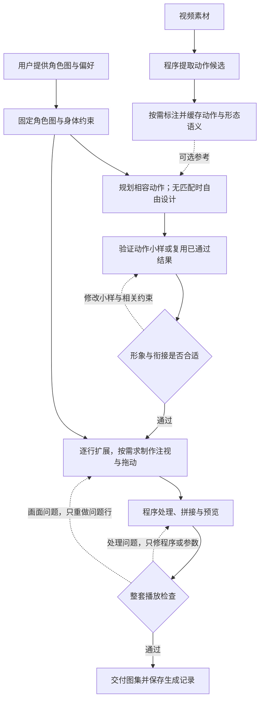

# 宠物动作图集生成流程

当前流程由项目工具 `video-actions`、语义技能 `reference-library-semantics` 和生成技能 `pet-action-atlas` 配合执行。`capylulu-pet` 保留原有参考输入与图集制作约定；新流程不自动修改现有运行时。

目标是：**每次绘图都用固定角色图和身体约束保持形象，按需参考动作，由程序处理素材与图集，尽量把返工限制在单行动作。动作召回为空时也保留完整角色依据。**

## 已实现与待验证

- 任务输入、实际绘图请求、结果及失败事实现统一记录在 `artifacts/work/<run>/`；程序处理保存输入／配置快照与行缓存事件，具体命令见 [任务目录与复盘记录](../.agents/skills/pet-action-atlas/references/run-records.md)。
- 已有图集新增固定像素比例的原图／候选对照，分别记录结构、形象、动作、尺度及播放验收。2026-09-08 对 9 行、57 帧的历史 v3 样本复查发现：帧数和 15 个空槽保持，但人物宽度中位数约为原图的 85%、高度约为 90%，且部分换脚和疲惫表情被改变。此样本用于验证失败识别；流程修订不代表已重新绘制或验收出改进图集。

- 视频提取工具已完成全部 8 个项目视频的实验，得到 38 个候选；程序校验与已知切镜、片尾问题的修复结果见 [提取实验](../video-actions/EXPERIMENTS.md)。
- 语义技能已建立，目前索引包含 3 条实际查看摘要后生成的记录；尚未全库标注，也没有独立的向量检索服务。记录包含未知项，不代表人工验收通过。
- 生成技能已更新为下面的流程。首次试验目前完成角色约束、少量选材和提示词准备，尚无按新流程生成并验收的最终图集，因此还不能评价最终画面质量或宣称减少了重试次数。

## 输入与分工

用户提供一张认可的完整角色图，并说明必须保留的服装、道具和希望的动作气质。例如：“戴黄色帽子，右手拿冰淇淋，动作悠闲，偶尔调皮。”

| 输入 | 用途 |
| --- | --- |
| 固定角色图与身体约束 | 每次生成或修复都提供，决定长相、比例、肢体形态、材质、服装和常驻道具 |
| 必要的形态证据 | 按同一角色、视角和身体部位查找，补充主图未说明清楚的细节；不受动作名称限制 |
| 可选动作参考 | 提供动作顺序、姿态和节奏；可以为空，不改变既定角色形象 |

模型负责理解参考、选择动作、生成画面和视觉复查。程序负责提取、指纹与缓存、切图、拼接、结构检查与预览。用户不需要逐帧设计动作；运行中的桌宠也不调用这些生成工具。

## 素材与语义建库

程序将 `video/` 提取到 `reference-library/actions/`，保留连续帧、八帧摘要、预览和来源清单。原始提取索引只有来源与程序分析信息，不能直接按语义排名。

`reference-library-semantics` 查看图像后，将简短动作描述、动作模式、形态与视角、道具依赖、未知项和证据位置写入独立的 `reference-library/semantics/index.jsonl`。可单独建立全库索引，也可在生成时只补当前需要的候选；未变化的记录复用，详细动作阶段按需补充。人工锁定的记录保留，切分或图片变化时检查是否过期。

动作和形态分别检索。例如，没有“抠鼻子”的动作标签，仍可找到正面头部或手臂形态证据，再在固定角色约束下自由设计动作。没有标签或关键词无命中不证明库中没有相关素材；未知的手部状态不能当作“双手空闲”。素材描述记录源片事实，改编方案属于本次生成记录。

## 核心流程

1. **先固定这一套角色及输出要求。** 记录已确认的比例、身体形态、服装、道具和左右关系，并读取目标项目的行数、有效帧及播放规则。初始图足够明确时直接复用；有控件遮挡、缺少全身或必要视角时再补充并检查，不把未知结构当作事实。
2. **读取已有语义记录，按需补充。** 先用记录筛选，再看少量相关摘要；有歧义才查看连续帧或预览。候选不等于完整动作，不将整理全库作为生成前置条件。
3. **分别选择形态与动作参考。** 每行默认最多一组主要动作参考，形态证据按需要补充。动作无匹配时自由设计，固定角色依据仍然完整保留；道具或姿态冲突时调整设计或换参考。
4. **验证动作小样。** 新建整套时先选择一条小幅动作、一条大幅动作，检查角色、道具、尺度和连续播放效果。已有合适小样或只修一行时直接复用已通过结果。
5. **逐行生成并复用成果。** 每次绘图或修复实际附上固定角色图和已确认的身体约束，另附本行动作、起止条件和必要参考，不能只依赖此前对话记忆。一行一个连贯动作，普通短动作可按八帧设计；注视和拖动使用各自的互动规则。
6. **程序组装，检查整套播放。** 完成切图、透明处理、统一对齐、拼接和结构检查，再检查行内动作、跨行衔接及鼠标互动。视频帧用于理解和重绘，不直接作为最终宠物帧。

## 如何保证形象一致、动作自然

**一套图集共用一种外观与常驻道具状态。** 如果宠物拿着冰淇淋，普通动作、注视和拖动都应保留它。参考视频里的另一套服装或手持物不能顺带进入结果。临时道具需要合理的拿出和收回过程，初期尽量少用。

**普通短动作尽量从共用休息姿态出发，收势后再切换。** 首尾图片相同并不足够，中间还需要自然的准备和恢复。程序对齐应保留有意的小跳、倾斜等位移，不能逐帧强行居中。

**鼠标互动单独设计。** 注视主要改变眼睛和头部，保持身体与道具稳定；拖动需要及时响应，并考虑进入、持续和松开后的恢复，不必等待普通动作完整结束。

动作多样性来自姿态、表情、节奏和幅度的变化。宠物模式可以调整动作选择、出现频率和间隔，保持这套角色的外观一致。

## 如何减少返工

- 固定角色图和约束贯穿每次绘图，每行只附必要参考，避免反复读取整个素材库。
- 先检查小样，尽早发现形象、尺度和衔接上的共性问题。
- 画面或动作出错，只重做对应行；切图、透明和拼接出错，优先修程序或参数。
- 已通过的行直接复用，修复后复查受影响的行和衔接，交付前检查最终整套。
- 记录生成耗时和重试次数。逐行生成便于局部修复，但调用次数更多，实际速度需要实验验证。

程序检查不能证明角色画得正确或动作自然，仍需保留视觉复查。

## 保留的设计取舍

视频数量不设硬性要求，以合适的动作片段为单位选材；现有参考足够时就停止补充，简单动作也可以不依赖视频。

注视与拖动按用户要求及播放器能力制作。当前 CapyLulu 的鼠标跟随使用 16 个方向、两行各八帧，从上方起顺时针排列；倒放不能补出缺失方向。若要改为八方向，需要单独调整运行时，不能仅减少素材帧数。

新技能不固定总行数，也不把 waiting / working / review 等存储名称当作动作脚本。现有 v2 默认布局仍是 8 列 × 11 行；自定义布局需要显式清单、足够的有效帧与实际加载验证。十行布局可以作为一次试验设计，不代表项目格式已经迁移；只有现有能力无法表达时才另行修改运行时。

相关入口：[视频提取工具](../video-actions/README.md)、[素材库](../reference-library/README.md)、[语义建库技能](../.agents/skills/reference-library-semantics/SKILL.md)、[生成技能](../.agents/skills/pet-action-atlas/SKILL.md)、[素材目录与恢复](asset-layout.md)。
